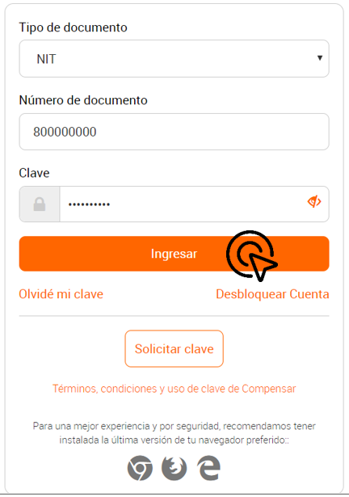

| Versión: 01       | MANUAL DE USUARIO                   | 
|-------------------|-------------------------------------|
| Fecha: 27/03/2020 | SWPR168-FUNCIONALIDADES PROVEEDORES |

| Fecha      | Descripción de la modificación               |
|------------|----------------------------------------------|
| 27/03/2020 | Versión Inicial                              |
| 04/08/2020 | Se añade radicación de facturas no obligados |

# **INDICE**

- [FUNCIONALIDADES PROVEEDORES](#funcionalidades-proveedores)
  - [1.	CONSULTAR ORDEN DE COMPRA](#1consultar-orden-de-compra)
  - [2.	CONSULTAR RECIBO A SATISFACCIÓN (RAS) O INGRESO DE MATERIALES](#2consultar-recibo-a-satisfacción-ras-o-ingreso-de-materiales)
  - [3.	EXTRACTO PROVEEDOR](#3extracto-proveedor)
- [RADICACIÓN DE FACTURAS NO OBLIGADOS](#radicación-de-facturas-no-obligados)
  - [4.	RADICACIÓN DE FACTURA CON ORDEN DE COMPRA](#4radicación-de-factura-con-orden-de-compra)
  - [5.	RADICACIÓN DE FACTURA CON ORDEN DE COMPRA Y DESTINO](#5radicación-de-factura-con-orden-de-compra-y-destino)
  - [6.	RADICACIÓN DE FACTURA CON AUTORIZACIÓN DE PAGO](#6radicación-de-factura-con-autorización-de-pago)
  - [7.	CONSULTA EXTRACTO DE HONORARIOS](#7consulta-extracto-de-honorarios)

# FUNCIONALIDADES PROVEEDORES
## 1.	CONSULTAR ORDEN DE COMPRA
**1.1** Ingresar a Transacciones en línea por medio de la página web de Compensar https://corporativo.compensar.com/

**1.2.** Seleccione el tipo de documento (NIT,CC, CE), ingrese el número de documento y contraseña.
>Para persona jurídica no incluir digito de verificación.

**1.3.** Ingresar al módulo de **finanzas**.

**1.4.** En la sección proveedores, seleccione el campo ***Detalle orden de compra Aceptación de servicio MIGO.***

**1.5.** En esta sección podrá consultar sus órdenes de compra por fecha o número de orden.

- **Número de Orden de Compra**
  
  

- **Fecha**

**1.6.** Para visualizar sus ordenes de compra debe hacer click en el logo PDF.

**1.7.** En el documento PDF podrá aceptar o rechazar la orden de compra.

>Si el proveedor rechaza la orden se enviará un correo electrónico al creador de la orden de compra con las observaciones de rechazo.

## 2.	CONSULTAR RECIBO A SATISFACCIÓN (RAS) O INGRESO DE MATERIALES

**2.1.** Para consultar el RAS de sus ordenes de compra, previamente debe buscar la orden de compra y dar click en la flecha botón.

**2.2.** En esta sección podrá visualizar y descargar el número de recibo a satisfacción y el detalle de la aceptación.

## 3.	EXTRACTO PROVEEDOR

**3.1.** Ingresar a Transacciones en línea por medio de la página web de Compensar https://corporativo.compensar.com/

**3.2.** Seleccione el tipo de documento (NIT,CC, CE), ingrese el número de documento y contraseña.
>Para persona jurídica no incluir digito de verificación.

**3.3.** Ingresar al módulo de finanzas.

**3.4.** En la sección proveedores, seleccione el campo ***Extracto Proveedor***.

**3.5.** En este campo podrá consultar la información de cuentas por pagar por rango de fechas.

>Nota: La consulta por rango de fechas se hace con base a la fecha de causación de la factura, la fecha de causación, aproximada 15 días después de la fecha de radicación.

**3.6.** En el extracto proveedor podrá consultar información de la cuenta por pagar, estado de pago, detalle de liquidación, e información de pago.

# RADICACIÓN DE FACTURAS NO OBLIGADOS
## 4.	RADICACIÓN DE FACTURA CON ORDEN DE COMPRA

**4.1.** Ingresar a Transacciones en línea por medio de la página web de Compensar https://corporativo.compensar.com/

**4.2.** Seleccione el tipo de documento (NIT,CC, CE), ingrese el número de documento y contraseña.
>Para persona jurídica no incluir digito de verificación.

**4.3.** Ingresar al módulo de finanzas.

**4.4.** En la sección proveedores, seleccione el campo ***Radicar Factura***.

**4.5.** El proveedor debe complementar la siguiente información:

- **email:** El sistema propone el email que se encuentra registrado por el proveedor en el ERP.
- **No. Factura:** El proveedor debe diligenciar el número de factura que va a radicar.
- **Tipo de documento:** El proveedor debe seleccionar el tipo de documento que va a radicar, el sistema propone los tipos de documentos contables para elección del proveedor.

>Si la factura a radicar cuenta con una orden de compra el proveedor debe marcar **SI** en la casilla de orden de compra.

**4.6.** Una vez complementada la información general, el proveedor debe ingresar a la pestaña **entradas orden de compra** buscar y agregar las ordenes de compra que se encuentren asociadas a la factura.

**4.7.** Una vez el proveedor agregue las ordenes de compra el sistema complementa los campos sub total factura, valor IVA, valor impoconsumo, valor total y moneda en la pantalla de información general.

**4.8.** En la pestaña de información de pago el proveedor seleccionará la forma de pago de acuerdo con negociación previa con Compensar.

**4.9.** Si el proveedor selecciona la forma de pago  **TRANSFERENCIA ACH** el sistema propone las cuentas que el proveedor tiene inscritas.

**4.10.** En la pestaña de **ADJUNTOS** el proveedor debe anexar los soportes físicos en formato PDF solicitados por Compensar. 

**4.11.** Finalizado el diligenciamiento del formato el proveedor debe seleccionar el botón enviar y confirmar el envió de la factura.

**4.12.** El sistema genera mensaje de radicación exitosa y presenta el número del caso con el cual fue radicada la factura. Adicionalmente, envía una notificación al correo electrónico diligenciado por el proveedor confirmando la radicación exitosa.

## 5.	RADICACIÓN DE FACTURA CON ORDEN DE COMPRA Y DESTINO

**5.1.** Ingresar a Transacciones en línea por medio de la página web de Compensar https://corporativo.compensar.com/

**5.2.** Seleccione el tipo de documento (NIT,CC, CE), ingrese el número de documento y contraseña.
>Para persona jurídica no incluir digito de verificación.

**a** Ingresar al módulo de finanzas.

**b** En la sección proveedores, seleccione el campo ***Radicar Factura***.

**5.3.** El proveedor debe complementar la siguiente información:

- **email:** El sistema propone el email que se encuentra registrado por el proveedor en el ERP.
- **No. Factura:** El proveedor debe diligenciar el número de factura que va a radicar.
- **Tipo de documento:** El proveedor debe seleccionar el tipo de documento que va a radicar, el sistema propone los tipos de documentos contables para elección del proveedor.

**5.4.**  Si la factura a radicar cuenta con una orden de compra el proveedor debe marcar **SI** en la casilla de orden de compra.

Si la orden de compra se encuentra asociada a un **Destino**, el proveedor debe seleccionar el destino en el cual se realiza la entrega de los productos y adicionalmente debe diligenciar los campos con la información de la factura.

- **Subtotal factura:** Valor subtotal de la factura
- **Valor IVA:** Valor IVA
- **Valor Impoconsumo:** Valor Impoconsumo
- **Valor Total y moneda:** Valor total y selección de moneda (COP, US, EUR)

**5.5** En la sección de ordenes el proveedor debe agregar las ordenes de compra asociadas a la factura.

**5.6.** En la pestaña de información de pago el proveedor seleccionará la forma de pago de acuerdo con negociación previa con Compensar.

**5.7.** Si el proveedor selecciona la forma de pago  **TRANSFERENCIA ACH** el sistema propone las cuentas que el proveedor tiene inscritas.

**5.8.** En la pestaña de **ADJUNTOS** el proveedor debe anexar los soportes físicos en formato **PDF** solicitados por Compensar. 

**5.9.** Finalizado el diligenciamiento del formato, el proveedor debe seleccionar el botón enviar y confirmar el envió de la factura.

**5.10.** El sistema genera mensaje de radicación exitosa y presenta el número del caso con el cual fue radicada la factura. Adicionalmente, envía una notificación al correo electrónico diligenciado por el proveedor confirmando la radicación exitosa.

## 6.	RADICACIÓN DE FACTURA CON AUTORIZACIÓN DE PAGO

**6.1.** Ingresar a Transacciones en línea por medio de la página web de Compensar https://corporativo.compensar.com/

**6.2.** Seleccione el tipo de documento (NIT,CC, CE), ingrese el número de documento y contraseña.
>Para persona jurídica no incluir digito de verificación.

**6.3.** Ingresar al módulo de finanzas.

**6.4.** En la sección proveedores, seleccione el campo ***Radicar Factura***.

**6.5.** El proveedor debe complementar la siguiente información:

- **email:** El sistema propone el email que se encuentra registrado por el proveedor en el ERP.
- **No. Factura:** El proveedor debe diligenciar el número de factura que va a radicar.
- **Tipo de documento:** El proveedor debe seleccionar el tipo de documento que va a radicar, el sistema propone los tipos de documentos contables para elección del proveedor.

**6.6.** El proveedor debe seleccionar el proceso con el cual Compensar realizó la autorización de pago y agregar las autorizaciones asociadas a la cuenta de cobro.

**6.7.** Una vez el proveedor agregue las autorizaciones de pago correspondientes, la pestaña de información general se actualiza con la información agregada.

**6.8.** En la pestaña de información de pago el proveedor seleccionará la forma de pago de acuerdo con negociación previa con Compensar.

**6.9.** Si el proveedor selecciona la forma de pago  **TRANSFERENCIA ACH** el sistema propone las cuentas que el proveedor tiene inscritas.

**6.10.** En la pestaña de **ADJUNTOS** el proveedor debe anexar los soportes físicos en formato **PDF** solicitados por Compensar. 

**6.11.** Finalizado el diligenciamiento del formato, el proveedor debe seleccionar el botón enviar y confirmar el envió de la factura.

**6.12.** El sistema genera mensaje de radicación exitosa y presenta el número del caso con el cual fue radicada la factura. Adicionalmente, envía una notificación al correo electrónico diligenciado por el proveedor confirmando la radicación exitosa.

## 7.	CONSULTA EXTRACTO DE HONORARIOS

**7.1.** Ingresar a Transacciones en línea por medio de la página web de Compensar https://corporativo.compensar.com/

**7.2.** Seleccione el tipo de documento (NIT,CC, CE), ingrese el número de documento y contraseña.
>Para persona jurídica no incluir digito de verificación.

**7.3.** Ingresar al módulo de finanzas.

**7.4.** En la sección proveedores, seleccione el campo ***Radicar Factura***.

**7.5.** En la primera sección "Información general" , el proveedor debe complementar la siguiente información:

- **email:** El sistema propone el email que se encuentra registrado por el proveedor en el ERP.
- **No. Factura:** El proveedor debe diligenciar el número de factura que va a radicar.
- **Tipo de documento:** El proveedor debe seleccionar el tipo de documento como **Cuenta de cobro**, de lo contrario no se le permitirá seleccionar el destino **Honorarios**
- **Orden de compra:** El proveedor debe marcar la orden de compra en **SI** para que se habilite la opción de destino.
- **Destino:** El proveedor debe seleccionar la opción **Honorarios**.

**7.6** La selección de honorarios como destino, habilita la segunda sección "Consultar extractos honorarios médicos", en esta sección el proveedor debe diligenciar el   ejercicio y periodo del extracto a consultar y dar click en :mag: para obtener los resultados. El sistema regresará un listado de los honorarios con su repectivo valor y el total.

**7.7** El proveedor debe verificar que una vez realizada la consulta de honorarios, en la primera sección de Información basica, el sistema a diligenciado automaticamente los campos del valor de la factura.

**7.8.** En la pestaña de información de pago el proveedor seleccionará la forma de pago de acuerdo con negociación previa con Compensar.

**7.9.** Si el proveedor selecciona la forma de pago  **TRANSFERENCIA ACH** el sistema propone las cuentas que el proveedor tiene inscritas.

**7.10.** En la pestaña de **ADJUNTOS** el proveedor debe anexar los soportes físicos en formato **PDF** solicitados por Compensar. 

**7.11.** Finalizado el diligenciamiento del formato, el proveedor debe seleccionar el botón enviar y confirmar el envió de la factura.

**7.12.** El sistema genera mensaje de radicación exitosa y presenta el número del caso con el cual fue radicada la factura. Adicionalmente, envía una notificación al correo electrónico diligenciado por el proveedor confirmando la radicación exitosa.

